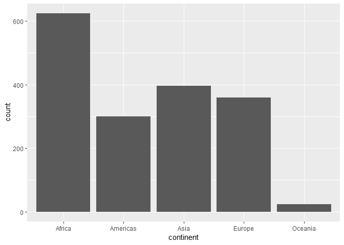
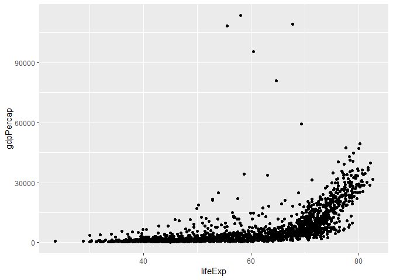
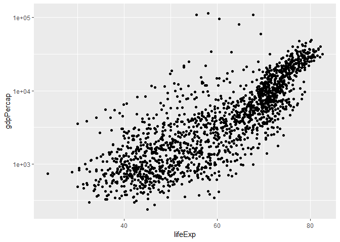
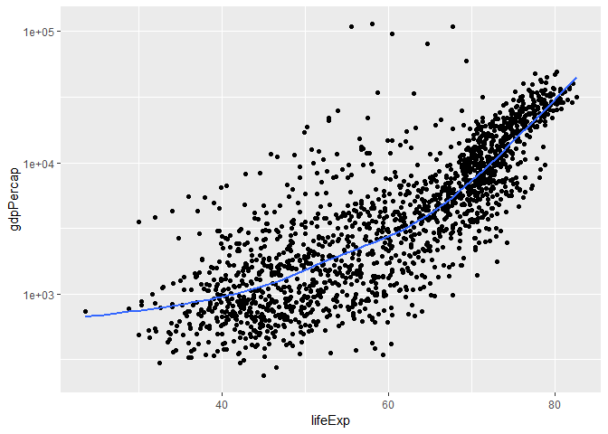
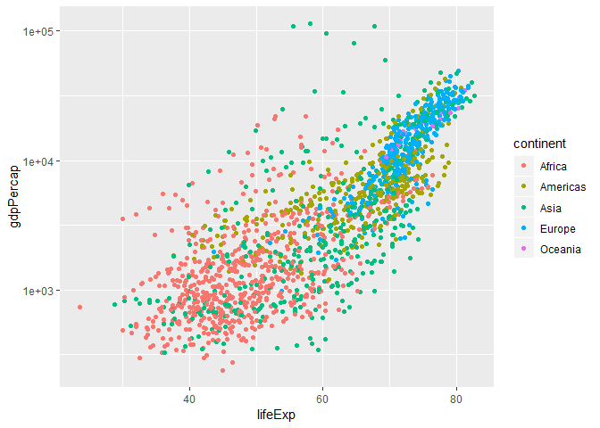
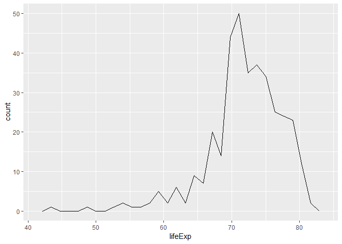
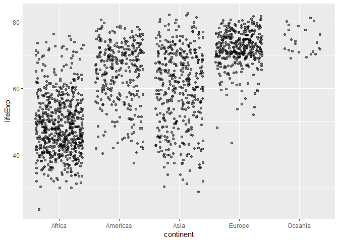
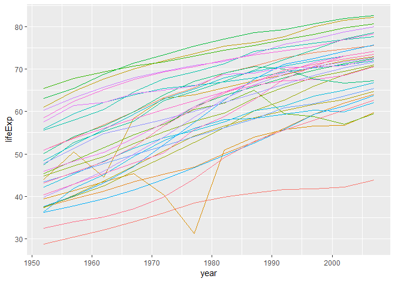
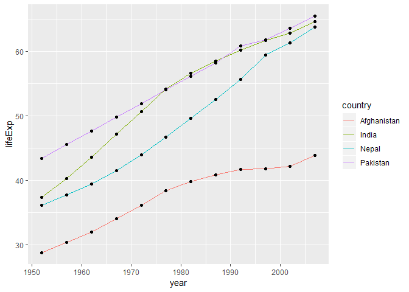

```r
library(tidyverse)
```

```
## -- Attaching packages --------------------------------------- tidyverse 1.2.1 --
```

```
## v ggplot2 3.0.0     v purrr   0.2.5
## v tibble  1.4.2     v dplyr   0.7.6
## v tidyr   0.8.1     v stringr 1.3.1
## v readr   1.1.1     v forcats 0.3.0
```

```
## -- Conflicts ------------------------------------------ tidyverse_conflicts() --
## x dplyr::filter() masks stats::filter()
## x dplyr::lag()    masks stats::lag()
```

```r
library(gapminder)
```

#### Smell test the data

Let's explore the data frame first:

```r
typeof(gapminder)
```

```
## [1] "list"
```

```r
class(gapminder)
```

```
## [1] "tbl_df"     "tbl"        "data.frame"
```

Gapminder has type: list and class: tbl_df i.e. tibble dataframe


```r
ncol(gapminder)
```

```
## [1] 6
```

```r
nrow(gapminder)
```

```
## [1] 1704
```

So, the given dataframe has 6 columns which means 6 variables and 1704 rows or observation.

Size of a dataframe can also be figured out using dim() which gives dimensions of a dataframe. So, nrow() and ncol() can be used in a code where columns and rows need to be used as a parameter for indexing separately.


```r
dim(gapminder)
```

```
## [1] 1704    6
```

Data type of each variable:


```r
sapply(gapminder,typeof)
```

```
##   country continent      year   lifeExp       pop gdpPercap 
## "integer" "integer" "integer"  "double" "integer"  "double"
```

The above output shows that a dataframe can consist of various data types which is the main difference between a dataframe and matrix.

#### Explore individual variable

* Categorical Variable: continent

> For a categorical variable, possible value can be checked using levels().


```r
levels(gapminder$continent)
```

```
## [1] "Africa"   "Americas" "Asia"     "Europe"   "Oceania"
```

```r
summary(gapminder$continent)
```

```
##   Africa Americas     Asia   Europe  Oceania 
##      624      300      396      360       24
```

```r
gapminder %>% 
  select(continent,lifeExp) %>% 
  ggplot(aes(continent)) + geom_bar()
```

<!-- -->


> Above output tells how many data points are there for each continent which can also be represted using barplot.


* Quantitative Variable

> The range can be checked using range()(which gives the min-max value of the variable in the dataframe)


```r
range(gapminder$lifeExp)
```

```
## [1] 23.599 82.603
```

```r
summary(gapminder$lifeExp)
```

```
##    Min. 1st Qu.  Median    Mean 3rd Qu.    Max. 
##   23.60   48.20   60.71   59.47   70.85   82.60
```

```r
hist(gapminder$lifeExp)
```

<!-- -->

> So, mean life expectancy is 59.47 but it varies from 23.60 to 82.60 with major observations around 65-75.


#### Explore various plot types

Let us explore the scatterplot first.

| Grammar Component     | Specification |
|-----------------------|---------------|
| __data__              | `gapminder` |
| __aesthetic mapping__ | 'x' and 'y' |
| __geometric object__  | point |
| scale                 | linear |
| statistical transform | none |
| coordinate system     | rectangular |
| facetting             | none |

I have considered two quantitative variables x = lifeExp and y = gdpPercap

Firstly, let us draw basic scatterplot using these two variables.


```r
a <- ggplot(gapminder,aes(lifeExp,gdpPercap))
a + geom_point()
```

<!-- -->

As we can see from the graph, the plot is exponential due to skewness of the data . This can be changed to linear trend by using scale() in geom_point or as shown below


```r
a + geom_point() +
  scale_y_log10()
```

<!-- -->

To understand the trend of data, geom_smooth() function can be used:


```r
a + geom_point() +
  scale_y_log10() +
  geom_smooth()
```

```
## `geom_smooth()` using method = 'gam' and formula 'y ~ s(x, bs = "cs")'
```

<!-- -->

geom_smooth fits a model("gam" in this case) to the given data in consideration. This model can be changed using method argument. The gray area around the line is point-wise confidence which can be switched off using "se = false".


```r
a + geom_point() +
  scale_y_log10() +
  geom_smooth(se=FALSE)
```

```
## `geom_smooth()` using method = 'gam' and formula 'y ~ s(x, bs = "cs")'
```

<!-- -->

We can also color code the graph for different continents:


```r
a + geom_point(aes(color = continent)) +
  scale_y_log10()
```

<!-- -->

This gives an idea that how the data from different continents is spread.


**Density plot**


```r
gapminder %>% 
  filter(continent=="Europe") %>% 
  ggplot(aes(lifeExp)) +
  geom_freqpoly()
```

```
## `stat_bin()` using `bins = 30`. Pick better value with `binwidth`.
```

<!-- -->

Frequency polygon graph shows the count of observations with a certain value of a quantitative variable. For example, there are around 44 observation with lifeExp = 70 in Europe database.

**Jitter Plot**

Lets jump back to categorical and quantitative variable we considered before and dive deep into it.

| Grammar Component     | Specification |
|-----------------------|---------------|
| __data__              | `gapminder` |
| __aesthetic mapping__ | 'x' and 'y' |
| __geometric object__  | boxplot |
| scale                 | linear |
| statistical transform | 5-number summary |


```r
ggplot(gapminder,aes(continent,lifeExp)) +
  geom_jitter(alpha = 0.5)
```

<!-- -->

```r
gapminder %>% 
  group_by(continent) %>%
  summarise(grp.mean = mean(lifeExp))
```

```
## # A tibble: 5 x 2
##   continent grp.mean
##   <fct>        <dbl>
## 1 Africa        48.9
## 2 Americas      64.7
## 3 Asia          60.1
## 4 Europe        71.9
## 5 Oceania       74.3
```

As we can see from the data above, average life expectancy in Oceania is the highest but it has very less number of observations.

Lets explore lifeExp for a single continent further.


```r
gapminder %>% 
  filter(continent == "Asia") %>% 
  ggplot(aes(year,lifeExp)) +
    geom_line(aes(color = country),show.legend = F)
```

<!-- -->

The above graph shows trend of lifeExp through 1952-2007 for different countries of Asia continent.

We can also filter a few countries to compare their data.


```r
gapminder %>%
  filter(country %in% c("India", "Afghanistan", "Pakistan","Nepal")) %>%
  ggplot(aes(year,lifeExp)) +
  geom_line(aes(group=country,color = country)) +
  geom_point()
```

<!-- -->

Here, it is clear that Afghanistan has lowest lifeExp. Also, lifeExp in India had a steeper increase from 1952-1977 and then slowed down.

#### Additional Exercise

For the code line given below, analyst did not get the intented result because he used "==" operator instead of %in%. So, the ouput showed Rawanda and Afghanistan data but for alternating years.

```r
filter(gapminder, country == c("Rwanda", "Afghanistan"))
```

```
## # A tibble: 12 x 6
##    country     continent  year lifeExp      pop gdpPercap
##    <fct>       <fct>     <int>   <dbl>    <int>     <dbl>
##  1 Afghanistan Asia       1957    30.3  9240934      821.
##  2 Afghanistan Asia       1967    34.0 11537966      836.
##  3 Afghanistan Asia       1977    38.4 14880372      786.
##  4 Afghanistan Asia       1987    40.8 13867957      852.
##  5 Afghanistan Asia       1997    41.8 22227415      635.
##  6 Afghanistan Asia       2007    43.8 31889923      975.
##  7 Rwanda      Africa     1952    40    2534927      493.
##  8 Rwanda      Africa     1962    43    3051242      597.
##  9 Rwanda      Africa     1972    44.6  3992121      591.
## 10 Rwanda      Africa     1982    46.2  5507565      882.
## 11 Rwanda      Africa     1992    23.6  7290203      737.
## 12 Rwanda      Africa     2002    43.4  7852401      786.
```

He should have used the following command:

```r
filter(gapminder, country %in% c("Rwanda", "Afghanistan"))
```

```
## # A tibble: 24 x 6
##    country     continent  year lifeExp      pop gdpPercap
##    <fct>       <fct>     <int>   <dbl>    <int>     <dbl>
##  1 Afghanistan Asia       1952    28.8  8425333      779.
##  2 Afghanistan Asia       1957    30.3  9240934      821.
##  3 Afghanistan Asia       1962    32.0 10267083      853.
##  4 Afghanistan Asia       1967    34.0 11537966      836.
##  5 Afghanistan Asia       1972    36.1 13079460      740.
##  6 Afghanistan Asia       1977    38.4 14880372      786.
##  7 Afghanistan Asia       1982    39.9 12881816      978.
##  8 Afghanistan Asia       1987    40.8 13867957      852.
##  9 Afghanistan Asia       1992    41.7 16317921      649.
## 10 Afghanistan Asia       1997    41.8 22227415      635.
## # ... with 14 more rows
```
